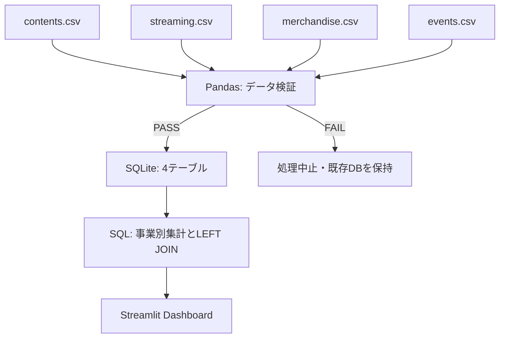

# Entertainment Cross-Domain Data Dashboard

**配信・物販・イベントを、一つのコンテンツ軸で見る。**

複数のエンターテインメント事業の架空データを検証し、SQLiteに集約して、
コンテンツ別の成果と月次推移を可視化する小規模な学習用プロジェクトです。

`Python` · `Pandas` · `SQLite` · `Streamlit`

**Collect → Validate → Store → Integrate → Analyze → Visualize**

韓国語の実行・コード学習ガイド: [START_HERE_KO.md](docs/START_HERE_KO.md)

## 1. Project Overview

- 8コンテンツ・3事業領域・12か月のMock Data（計224行）
- CSVの品質検証とSQLiteへの再実行可能な一括ロード
- 全社KPI、配信推移、物販売上、配信と物販の比較
- 期間フィルター、コンテンツ別の詳細表示、検証結果の確認

すべて架空の名称・数値です。実在企業の内部システムやデータを再現したものではありません。
自然言語からSQLを生成する機能は、このMVPには含めていません。

## 2. Motivation

カバー株式会社のEngineering Meet-up 2026に参加し、複数の事業領域にまたがる
データを集約し、正しく横断的に活用するという考え方に興味を持ちました。
その考え方を理解するため、CSVの収集から検証・保存・集計・可視化までを
小さな環境で一通り扱うことを目標にしています。

高度な基盤の導入よりも、処理の流れを自分で読んで説明できる規模を優先しました。
実装・検証・ドキュメント作成にはChatGPT/Codexを活用しています。

## 3. Architecture



| ファイル | 役割 |
|---|---|
| `src/generate_data.py` | 固定seedによるMock Data生成 |
| `src/settings.py` | パス、カラム、キー、単位の検証対象 |
| `src/validate.py` | データ品質の検証と結果表示 |
| `src/load_data.py` | 全件検証後のDBスナップショット作成 |
| `src/analysis.py` | 読み取り専用接続と集計SQL |
| `app.py` | ダッシュボード |
| `data/raw/*.csv` | 再現可能なサンプル入力 |
| `data/entertainment.db` | ローカル生成物。Gitの管理対象外 |
| `tests/` | 検証・集計・UIの回帰テスト |

DBは一時ファイルへ完全に書き込んでから置き換えます。
繰り返しロードしても既存行への追記は行わず、重複を増やしません。
データ量が小さいため、複雑なジョブ基盤やキャッシュは使用していません。

## 4. Dataset

対象期間は **2025-01〜2025-12**、通貨は **JPY（整数の円）** です。

| CSV / テーブル | 行数 | 1行の粒度・一意キー | カラムと単位 |
|---|---:|---|---|
| `contents` | 8 | 1コンテンツ / `content_id` | `content_id`, `title`, `category`, `release_date`（YYYY-MM-DD） |
| `streaming` | 96 | 1コンテンツ・1か月 / `content_id, month` | `month`（YYYY-MM）, `views`（再生回数）, `watch_time`（四捨五入した総視聴時間・時間） |
| `merchandise` | 96 | 1コンテンツ・1か月 / `content_id, month` | `sales_count`（販売個数）, `revenue`（物販売上・円） |
| `events` | 24 | 1コンテンツ・1開催日 / `content_id, event_date` | `event_date`（YYYY-MM-DD）, `participants`（延べ参加人数）, `ticket_revenue`（チケット売上・円） |

事業データにはすべて`content_id`があります。イベントは1コンテンツにつき1日1件と仮定しています。
複数イベントを同日に扱う場合は、将来`event_id`を追加する必要があります。

- 配信の人気と物販の需要は別の基準値から生成します。
- 成長率や季節性は生成ロジックに組み込んだ仮定で、実在市場の分析結果ではありません。
- `C007`と`C008`にはイベントを設定していません。イベントのないコンテンツも表示されます。
- このMock Dataでは欠けた事業行を「記録された活動なし」として0表示します。実務では未着データとの区別が必要です。

## 5. Data Validation

全カラムを必須とし、次を検証します。

| 検証 | 例 | 失敗時 |
|---|---|---|
| 必須テーブル・カラム | `revenue`列がない | ロード中止 |
| NULL・空文字 | タイトルが空欄 | ロード中止 |
| 完全一致行・業務キーの重複 | 同じコンテンツ・月が2行 | ロード中止 |
| 数値・非負整数・範囲 | `views = -1`、数値以外、無限大 | ロード中止 |
| 日付の書式と実在性 | `2025-02-30` | ロード中止 |
| マスター参照 | 存在しない`content_id` | ロード中止 |

```text
[PASS] streaming.duplicate business keys: 0 issue(s)
[PASS] merchandise.revenue: non-negative: 0 issue(s)
[PASS] events.content_id reference: 0 issue(s)
Validation passed.
```

検証スクリプトは成功時に終了コード0、失敗時に1を返します。
不正な行の削除やNULLの自動補完は行いません。入力CSVを修正して再実行します。
空の事業テーブルは許容し、空のコンテンツマスターは拒否します。
DB側には業務キーのUNIQUEインデックスを作成し、その他の検証はPythonで実施します。

## 6. Cross-domain Analysis

**各事業を先にコンテンツ単位で集計し、その結果をJOINします。**

例えば、あるコンテンツに配信12行・物販12行・イベント4行がある場合、
`content_id`だけで元データを直接JOINすると576行に増え、SUMが過大になります。
`src/analysis.py`では各事業を1コンテンツ1行にしてから結合します。

```sql
WITH streaming_totals AS (
    SELECT content_id, SUM(views) AS views
    FROM streaming
    GROUP BY content_id
), merchandise_totals AS (
    SELECT content_id, SUM(revenue) AS revenue
    FROM merchandise
    GROUP BY content_id
)
SELECT c.title,
       COALESCE(s.views, 0) AS views,
       COALESCE(m.revenue, 0) AS revenue
FROM contents c
LEFT JOIN streaming_totals s ON c.content_id = s.content_id
LEFT JOIN merchandise_totals m ON c.content_id = m.content_id;
```

実装ではイベントの集計と期間条件も追加しています。
SQLの期間・コンテンツ条件はパラメーターで渡し、接続は`mode=ro`にしています。

| 表示指標 | 定義 |
|---|---|
| Streaming views | 選択期間の再生回数合計。ユニーク視聴者数ではない |
| Merchandise revenue | 選択期間の物販売上合計。チケット売上を含まない |
| Event attendances | 選択期間の延べ参加人数。ユニーク人数ではない |
| Contents in catalog | 登録済みの全コンテンツ数。期間内の活動件数ではない |

散布図では単位の異なる再生回数と売上を別々の軸に置いています。
関連が見えても、配信が物販を増加させたという因果関係は示せません。

## 7. Dashboard Screenshot

実際のStreamlitアプリで、標準seed・全期間を表示した画面です。


- **Company overview:** 4つのKPI、月別配信推移、コンテンツ別物販売上、散布図
- **Content explorer:** コンテンツ選択、個別KPI、指標を切り替える月別グラフ
- **Data quality:** 読み込み済みDBの検証結果。CSV編集後は再ロードが必要

## 8. How to Run

**Python 3.12推奨。** Python 3.12 / Pandas 2.2.3 / Streamlit 1.64.0で動作確認しています。
SQLiteとunittestはPython標準ライブラリです。APIキーや外部DBは不要です。

ZIPを展開するかリポジトリをcloneし、`app.py`があるフォルダーで実行してください。

### Windows / PowerShell

```powershell
py -3.12 -m venv .venv
.\.venv\Scripts\python.exe -m pip install -r requirements.txt
.\.venv\Scripts\python.exe -m src.generate_data
.\.venv\Scripts\python.exe -m src.validate
.\.venv\Scripts\python.exe -m src.load_data
.\.venv\Scripts\python.exe -m streamlit run app.py
```

### macOS / Linux

```bash
python3 -m venv .venv
.venv/bin/python -m pip install -r requirements.txt
.venv/bin/python -m src.generate_data
.venv/bin/python -m src.validate
.venv/bin/python -m src.load_data
.venv/bin/python -m streamlit run app.py
```

ブラウザーで `http://localhost:8501` を開きます。終了はターミナルで `Ctrl+C`。
CSVは同梱済みのため、生成コマンドは省略できます。再生成すると既存CSVを上書きします。
CSVを編集した場合は`src.load_data`を再実行し、ブラウザーを再読み込みします。

仮想環境を有効化した後は、以下の短い形式でも実行できます。

```bash
python -m src.analysis
python -m unittest discover -s tests -v
```

テスト前に`python -m src.load_data`を実行してください。
DBがない場合、UIテストはスキップされます。パイプラインテストは一時フォルダーを使用します。

| Phase | 実行確認 |
|---|---|
| 1. CSV生成・検証 | `python -m src.generate_data` → `python -m src.validate` |
| 2. 保存・集計 | `python -m src.load_data` → `python -m src.analysis` |
| 3. UI | `python -m streamlit run app.py` |
| 4. 文書・検証 | README、スクリーンショット、テスト結果 |

## 9. What I Learned

この実装から確認できる学習ポイントです。

1. **一か所で使う:** 共通キーと粒度を定めると、異なる事業のデータを組み合わせられる。
2. **正しく使う:** 保存前の検証に加え、JOINの順序やKPIの定義も集計の正確さに影響する。
3. **安全に扱う:** 架空データ・読み取り専用接続・パラメーター化SQLを小さな範囲で適用できる。
4. **変化を見る:** 全体推移とコンテンツ別の内訳を分けると、異なる側面を比較できる。

これは個人のローカル学習用です。認証・権限管理・監査ログ・本番運用の可用性は未実装です。
データガバナンス全体を実装したと主張するものではありません。

## 10. Future Improvements

- 未着データとゼロ活動を区別する取り込み状態の管理
- 同日複数イベントに対応する`event_id`の追加
- 検証履歴や取り込み時刻の保存
- データ辞書と品質ルールの拡充
- MVPを理解した後の自然言語→SQL（読み取り専用制約・実行制限を含む）

## References

- [Streamlit chart documentation](https://docs.streamlit.io/develop/api-reference/charts/st.scatter_chart)
- [Streamlit app testing](https://docs.streamlit.io/develop/api-reference/app-testing)
- [Pandas DataFrame.to_sql](https://pandas.pydata.org/docs/reference/api/pandas.DataFrame.to_sql.html)
- [Python sqlite3](https://docs.python.org/3/library/sqlite3.html)
