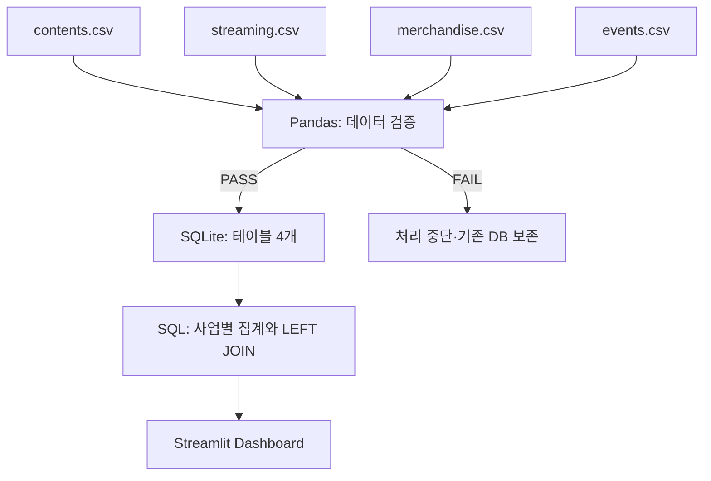

# Entertainment Cross-Domain Data Dashboard

**스트리밍·상품 판매·이벤트를 하나의 콘텐츠 축으로 살펴봅니다.**

여러 엔터테인먼트 사업의 가상 데이터를 검증하고 SQLite에 통합하여,
콘텐츠별 성과와 월별 추이를 시각화하는 소규모 학습용 프로젝트입니다.

`Python` · `Pandas` · `SQLite` · `Streamlit`

**Collect → Validate → Store → Integrate → Analyze → Visualize**

일본어판: [README.md](README.md)

## 1. 프로젝트 개요

- 콘텐츠 8개·사업 영역 3개·12개월의 가상 데이터(총 224행)
- CSV 품질 검증과 재실행 가능한 SQLite 일괄 적재
- 전사 KPI, 스트리밍 추이, 상품 매출, 스트리밍과 상품 판매 비교
- 기간 필터, 콘텐츠별 상세 화면, 검증 결과 확인

모든 명칭과 수치는 가상이며 실제 기업의 내부 시스템이나 데이터를 재현하지 않습니다.
자연어로 SQL을 생성하는 기능은 이 MVP에 포함되어 있지 않습니다.

## 2. 아키텍처



| 파일 | 역할 |
|---|---|
| `src/generate_data.py` | 고정 seed를 사용한 가상 데이터 생성 |
| `src/settings.py` | 경로, 컬럼, 키, 단위에 관한 검증 설정 |
| `src/validate.py` | 데이터 품질 검증과 결과 출력 |
| `src/load_data.py` | 전체 검증 후 DB 스냅샷 생성 |
| `src/analysis.py` | 읽기 전용 연결과 집계 SQL |
| `app.py` | 대시보드 |
| `data/raw/*.csv` | 재현 가능한 샘플 입력 데이터 |
| `data/entertainment.db` | 로컬 생성물이며 Git 관리 대상에서 제외 |
| `tests/` | 검증·집계·UI 회귀 테스트 |

DB는 임시 파일에 완전히 기록한 후 기존 파일을 교체합니다.
적재를 반복해도 기존 행에 추가하지 않으므로 중복이 늘어나지 않습니다.
데이터 규모가 작아 복잡한 작업 실행 기반이나 캐시는 사용하지 않습니다.

## 3. 데이터셋

대상 기간은 **2025-01~2025-12**, 통화는 **JPY(정수 엔화)**입니다.

| CSV / 테이블 | 행 수 | 한 행의 단위·고유 키 | 컬럼과 단위 |
|---|---:|---|---|
| `contents` | 8 | 콘텐츠 1개 / `content_id` | `content_id`, `title`, `category`, `release_date`(YYYY-MM-DD) |
| `streaming` | 96 | 콘텐츠 1개·한 달 / `content_id, month` | `month`(YYYY-MM), `views`(조회수), `watch_time`(반올림한 총 시청시간·시간) |
| `merchandise` | 96 | 콘텐츠 1개·한 달 / `content_id, month` | `sales_count`(판매 수량), `revenue`(상품 매출·엔) |
| `events` | 24 | 콘텐츠 1개·개최일 1일 / `content_id, event_date` | `event_date`(YYYY-MM-DD), `participants`(연인원 참가자 수), `ticket_revenue`(티켓 매출·엔) |

모든 사업 데이터에는 `content_id`가 있습니다. 이벤트는 콘텐츠 하나당 하루에 한 건이라고 가정합니다.
같은 날 여러 이벤트를 처리하려면 향후 `event_id`를 추가해야 합니다.

- 스트리밍 인기와 상품 수요는 서로 다른 기준값에서 생성합니다.
- 성장률과 계절성은 생성 로직에 포함한 가정이며 실제 시장 분석 결과가 아닙니다.
- `C007`과 `C008`에는 이벤트가 없지만, 이벤트가 없는 콘텐츠도 화면에 표시됩니다.
- 이 가상 데이터에서는 누락된 사업 행을 '기록된 활동 없음'으로 보고 0으로 표시합니다. 실무에서는 미도착 데이터와 구분해야 합니다.

## 4. 데이터 검증

모든 컬럼을 필수로 보고 다음 항목을 검증합니다.

| 검증 | 예시 | 실패 시 처리 |
|---|---|---|
| 필수 테이블·컬럼 | `revenue` 컬럼 없음 | 적재 중단 |
| NULL·빈 문자열 | 제목이 비어 있음 | 적재 중단 |
| 완전 중복 행·업무 키 중복 | 같은 콘텐츠와 같은 월이 2행 | 적재 중단 |
| 숫자·음이 아닌 정수·범위 | `views = -1`, 숫자가 아닌 값, 무한대 | 적재 중단 |
| 날짜 형식과 유효성 | `2025-02-30` | 적재 중단 |
| 마스터 참조 | 존재하지 않는 `content_id` | 적재 중단 |

```text
[PASS] streaming.duplicate business keys: 0 issue(s)
[PASS] merchandise.revenue: non-negative: 0 issue(s)
[PASS] events.content_id reference: 0 issue(s)
Validation passed.
```

검증 스크립트는 성공하면 종료 코드 0, 실패하면 1을 반환합니다.
잘못된 행을 삭제하거나 NULL을 자동으로 채우지 않으며 입력 CSV를 수정한 뒤 다시 실행합니다.
빈 사업 테이블은 허용하지만 빈 콘텐츠 마스터는 거부합니다.
DB에는 업무 키의 UNIQUE 인덱스를 생성하고, 나머지 검증은 Python에서 수행합니다.

## 5. 교차 도메인 분석

**각 사업 데이터를 콘텐츠 단위로 먼저 집계한 다음 결과를 JOIN합니다.**

예를 들어 콘텐츠 하나에 스트리밍 12행·상품 판매 12행·이벤트 4행이 있다면,
원본 데이터를 `content_id`만으로 바로 JOIN할 경우 576행으로 늘어나 합계가 부풀려집니다.
`src/analysis.py`는 각 사업을 콘텐츠당 1행으로 만든 후 결합합니다.

```sql
WITH streaming_totals AS (
    SELECT content_id, SUM(views) AS views
    FROM streaming
    GROUP BY content_id
), merchandise_totals AS (
    SELECT content_id, SUM(revenue) AS revenue
    FROM merchandise
    GROUP BY content_id
)
SELECT c.title,
       COALESCE(s.views, 0) AS views,
       COALESCE(m.revenue, 0) AS revenue
FROM contents c
LEFT JOIN streaming_totals s ON c.content_id = s.content_id
LEFT JOIN merchandise_totals m ON c.content_id = m.content_id;
```

실제 구현에는 이벤트 집계와 기간 조건도 포함됩니다.
SQL의 기간·콘텐츠 조건은 파라미터로 전달하고 연결에는 `mode=ro`를 사용합니다.

| 표시 지표 | 정의 |
|---|---|
| Streaming views | 선택한 기간의 조회수 합계. 고유 시청자 수가 아님 |
| Merchandise revenue | 선택한 기간의 상품 매출 합계. 티켓 매출은 포함하지 않음 |
| Event attendances | 선택한 기간의 연인원 참가자 수. 고유 인원 수가 아님 |
| Contents in catalog | 등록된 전체 콘텐츠 수. 기간 내 활동한 콘텐츠 수가 아님 |

산점도는 단위가 다른 조회수와 매출을 서로 다른 축에 표시합니다.
관련성이 보이더라도 스트리밍이 상품 판매를 증가시켰다는 인과관계를 의미하지 않습니다.

## 6. 실행 방법

**Python 3.12를 권장합니다.** Python 3.12 / Pandas 2.2.3 / Streamlit 1.64.0에서 동작을 확인했습니다.
SQLite와 unittest는 Python 표준 라이브러리이며 API 키나 외부 DB는 필요하지 않습니다.

ZIP 압축을 풀거나 저장소를 clone한 뒤 `app.py`가 있는 폴더에서 실행하세요.

### Windows / PowerShell

```powershell
py -3.12 -m venv .venv
.\.venv\Scripts\python.exe -m pip install -r requirements.txt
.\.venv\Scripts\python.exe -m src.generate_data
.\.venv\Scripts\python.exe -m src.validate
.\.venv\Scripts\python.exe -m src.load_data
.\.venv\Scripts\python.exe -m streamlit run app.py
```

### macOS / Linux

```bash
python3 -m venv .venv
.venv/bin/python -m pip install -r requirements.txt
.venv/bin/python -m src.generate_data
.venv/bin/python -m src.validate
.venv/bin/python -m src.load_data
.venv/bin/python -m streamlit run app.py
```

브라우저에서 `http://localhost:8501`을 엽니다. 종료하려면 터미널에서 `Ctrl+C`를 누릅니다.
CSV가 포함되어 있으므로 생성 명령은 생략할 수 있습니다. 다시 생성하면 기존 CSV를 덮어씁니다.
CSV를 수정했다면 `src.load_data`를 다시 실행하고 브라우저를 새로고침하세요.

가상환경을 활성화한 뒤에는 다음과 같이 짧게 실행할 수도 있습니다.

```bash
python -m src.analysis
python -m unittest discover -s tests -v
```

테스트 전에 `python -m src.load_data`를 실행하세요.
DB가 없으면 UI 테스트는 건너뛰며 파이프라인 테스트는 임시 폴더를 사용합니다.

| 단계 | 실행 확인 |
|---|---|
| 1. CSV 생성·검증 | `python -m src.generate_data` → `python -m src.validate` |
| 2. 저장·집계 | `python -m src.load_data` → `python -m src.analysis` |
| 3. UI | `python -m streamlit run app.py` |
| 4. 회귀 테스트 | `python -m unittest discover -s tests -v` |

## 7. 향후 개선 사항

- 미도착 데이터와 활동이 0인 데이터를 구분하는 적재 상태 관리
- 같은 날 여러 이벤트를 처리하기 위한 `event_id` 추가
- 검증 이력과 적재 시각 저장
- 데이터 사전과 품질 규칙 확장
- MVP 이해 후 자연어→SQL 추가(읽기 전용 제약과 실행 제한 포함)
